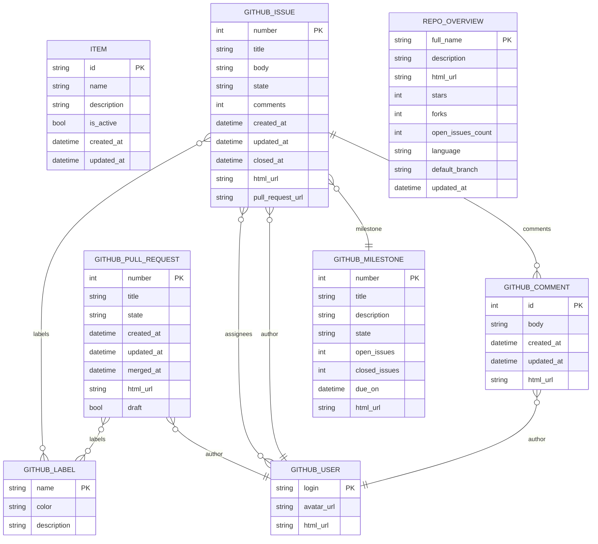

# Architecture Overview

This document explains how the FastAPI React Aspire starter template works, including the data flow, telemetry pipeline, and key design decisions.

## System Architecture

```text
┌─────────────────────────────────────────────────────────────────────────────┐
│                              .NET Aspire                                    │
│                         (apphost.cs orchestrator)                           │
│                                                                             │
│  ┌──────────────────┐    ┌──────────────────┐    ┌──────────────────────┐  │
│  │   React Frontend │    │  FastAPI Backend │    │   Aspire Dashboard   │  │
│  │   (Vite + SSR)   │───►│  (Uvicorn)       │    │   (OTEL Collector)   │  │
│  │   Port: 5173     │    │  Port: 8000      │    │   Port: 15888        │  │
│  └──────────────────┘    └──────────────────┘    └──────────────────────┘  │
│           │                       │                        ▲               │
│           │                       │                        │               │
│           └───────────────────────┴────────────────────────┘               │
│                           OpenTelemetry (gRPC/HTTP)                        │
└─────────────────────────────────────────────────────────────────────────────┘
```

## Data Flow

### 1. Development Mode (aspire run)

```text
Browser ──► Vite Dev Server ──► /api proxy ──► FastAPI ──► In-Memory Storage
   │              │                   │            │
   └──────────────┴───────────────────┴────────────┴──► Aspire OTLP Endpoint
                        (Traces & Logs)
```

### 2. Production Mode (aspire deploy)

```text
Browser ──► Azure Container App (Web) ──► Azure Container App (API) ──► Cosmos DB
   │                  │                            │
   └──────────────────┴────────────────────────────┴──► Azure Monitor / App Insights
                              (Traces & Logs)
```

## Data Model Diagram

The following ER diagram reflects the current API data contracts defined in:

- [api/app/modules/items/schemas.py](api/app/modules/items/schemas.py)
- [api/app/modules/projects/schemas.py](api/app/modules/projects/schemas.py)



## OpenTelemetry Pipeline

### Backend Tracing (Python)

The backend uses OpenTelemetry to automatically trace all requests:

```text
HTTP Request
    │
    ▼
FastAPI Middleware (auto-instrumented)
    │
    ▼
Route Handler (trace_span context manager)
    │
    ▼
Service Method (@trace decorator)
    │
    ▼
OTLP gRPC Exporter ──► Aspire Dashboard
```

**Key files:**

- [api/app/telemetry.py](api/app/telemetry.py) - Configures OTEL exporters
- [api/app/common/tracer.py](api/app/common/tracer.py) - `@trace` decorator and `trace_span()`

### Frontend Tracing (Browser)

The frontend sends traces for fetch requests:

```text
User Action (click, navigate)
    │
    ▼
traced() wrapper function
    │
    ▼
fetch() with FetchInstrumentation
    │
    ▼
OTLP HTTP Exporter ──► Aspire Dashboard
```

**Key files:**

- [web/lib/telemetry.ts](web/lib/telemetry.ts) - Browser OTEL setup
- [web/app/root.tsx](web/app/root.tsx) - Initializes telemetry on app load

## Environment Variables

All configuration flows through Aspire-managed environment variables:

| Variable                      | Set By     | Used By | Description           |
| ----------------------------- | ---------- | ------- | --------------------- |
| `APP_DATABASE_CONNECTION` | apphost.cs | API | Cosmos DB endpoint |
| `APP_DATABASE_NAME` | apphost.cs | API | Database name |
| `APP_STORAGE_CONNECTION` | apphost.cs | API | Blob storage endpoint |
| `APP_STORAGE_CONTAINER` | apphost.cs | API | Container name |
| `APP_FOUNDRY_ENDPOINT` | apphost.cs | API | Azure AI Foundry URL |
| `OTEL_EXPORTER_OTLP_ENDPOINT` | Aspire | API/Web | Telemetry collector |
| `OTEL_SERVICE_NAME` | Aspire | API/Web | Service name in traces |
| `API_ENDPOINT_HTTP` | apphost.cs | Web | Backend API URL |

## Module Pattern Deep Dive

### Why This Pattern?

The module pattern separates concerns and makes the codebase:

- **Testable** - Services can be tested in isolation with mocks
- **Traceable** - Every operation creates spans in the dashboard
- **Scalable** - New features are self-contained modules

### File Responsibilities

```text
modules/items/
├── __init__.py      # Public API: what other modules can import
├── schemas.py       # Data contracts (Pydantic models)
│                    # - ItemBase, ItemCreate, Item, PagedResponse
│
├── service.py       # Business logic (no HTTP knowledge)
│                    # - @trace decorator on all methods
│                    # - Returns domain objects, not HTTP responses
│                    # - Injected via dependency injection
│
└── routes.py        # HTTP layer (no business logic)
                     # - Route definitions with OpenAPI docs
                     # - Input validation via Pydantic
                     # - trace_span() for request-level tracing
                     # - HTTPException for error responses
```

### Dependency Injection Flow

```text
Request arrives
    │
    ▼
FastAPI calls route handler
    │
    ▼
Depends(get_item_service) triggered
    │
    ▼
get_item_service() creates ItemService
    │  (optionally with CosmosService, StorageService)
    │
    ▼
Service method called
    │
    ▼
Response returned
```

## Testing Strategy

### Unit Tests (Fast, Isolated)

```text
Test ──► MockCosmosService ──► Service ──► Assert
```

- Use `MockCosmosService` from `tests/mocks/cosmos.py`
- Test service logic without real databases
- Run with `uv run pytest tests/unit/`

### Integration Tests (Full Stack)

```text
Test ──► httpx.AsyncClient ──► FastAPI App ──► Real/Mock Services
```

- Test HTTP layer with real routing
- Run with `uv run pytest tests/integration/`

### E2E Tests (Browser)

```text
Playwright ──► Browser ──► Web App ──► API ──► Database
```

- Test real user flows
- Requires `aspire run` first
- Run with `npm run test:e2e`

## Key Design Decisions

### 1. In-Memory Storage by Default

The starter uses in-memory `dict` storage so it works without Azure setup. This lets developers:

- Run immediately without configuration
- Focus on learning the patterns
- Add persistence when ready (see AGENTS.md)

### 2. Aspire for Orchestration

Aspire provides:

- **Single command startup** - `aspire run` starts everything
- **Automatic environment config** - No manual .env files
- **Built-in telemetry** - Dashboard with traces/logs
- **Azure deployment** - `aspire deploy` for production

### 3. OpenTelemetry Everywhere

Both frontend and backend emit traces to the same collector:

- **Correlated traces** - See full request flow across services
- **Production ready** - Same instrumentation works with Azure Monitor
- **Debug friendly** - Aspire dashboard shows everything locally

### 4. React Router v7 with SSR

The frontend uses React Router v7's framework mode:

- **Server-side rendering** - Better SEO and initial load
- **File-based routing** - Intuitive `app/routes/` structure
- **Type-safe loaders** - Data fetching with TypeScript

## Extending the Template

See [AGENTS.md](AGENTS.md) for detailed instructions on adding:

- Azure Cosmos DB
- Azure Blob Storage
- Azure AI Foundry
- Authentication
- Playwright E2E tests

## Troubleshooting

### Common Issues

| Symptom              | Cause              | Solution                                              |
| -------------------- | ------------------ | ----------------------------------------------------- |
| `aspire run` fails | Old CLI version | `curl -sSL https://aspire.dev/install.sh \| bash` |
| API not found | Port conflict | Check Aspire dashboard for actual ports |
| Traces not showing | OTEL not configured | Verify `configure_opentelemetry()` runs |
| Web can't reach API | Proxy not working | Check `vite.config.ts` proxy settings |
| Tests fail in CI | Missing files | Ensure all files committed (check `.gitignore`) |

### Debug Checklist

1. **Check Aspire Dashboard** (<http://localhost:15888>)
   - Are all resources green?
   - Any error logs?

2. **Check API directly** (<http://localhost:8000/docs>)
   - Does Swagger UI load?
   - Can you call endpoints?

3. **Check Web dev server**
   - Any console errors?
   - Network tab showing API calls?

4. **Check traces**
   - Do spans appear in dashboard?
   - Any error spans (red)?
